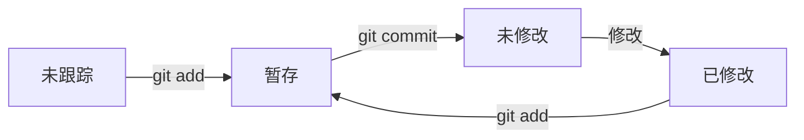

**目的：管理项目开发的源码**
编程的中 **“S\L”大法**

**目录**
[TOC]

$\sin x$

#### 简介
项目的开发是一个不断迭代的过程，开发过程中程序员需要不断的对代码进行编写和更正。这就带来很多的问题。
- 首先，开发中代码会存在多个版本，我们如何将代码在**多个版本间进行切换**？
- 第二，代码上线后，如何在不影响现行开发工作的情况下**对代码进行维护**？
- 第三，开发时某段代码被多人修改时，**如何处理代码的冲突问题**？
- 除此之外，还有存储效率、远程仓库等问题。

**git** 是一个免费开源的版本控制系统，它被设计用来快速高效地**管理项目开发的源码**。通过git
- 可以**跟踪**代码的状态，
- 也可以在修改代码后对代码状态进行**存储**，
- 还可以在需要时将已经修改过的代码**恢复**到之前存储的状态。
- 更强大的是使用 git **管理**代码时，可以创建代码分支（**branch**），代码分支相当于一段**独立的代码记录**，我们可以在分支上对代码进行任意的修改，而这个修改只会影响当前分支，不会对其他分支产生影响。
- 同时，可以对分支进行**合并**，合并后一个分支的修改便可在另一分支上生效。

总之，git是当今最优秀的版本控制工具！

学习的主要资料：
- **B 站《 Git 和 GitHub 视频教程》- 李立超**
https://www.bilibili.com/video/BV1124y117Dr/?share_source=copy_web
- 作者网页：https://www.lilichao.com/index.php/2022/11/21/git%e7%ae%80%e4%bb%8b/
- CSDN 上的文章（详细中文解释）
  https://blog.csdn.net/weixin_42141390/article/details/108023783

#### 常用处理

##### 1.操作“平台”
- 命令行操作
- VSCode 中操作（图形化 git）
  直接操作就可以了，如果装一个插件（**GitLens**）会更方便点


##### 2.如何保存？
- 流程如下：

  ```mermaid
  graph LR
    n1[初始化项目] & n4[修改文件] --> n2[跟踪文件] --> n3[提交]
  ```
- 命令如下：
  ```mermaid
  graph LR
    n1[git init] & n4[修改文件] --> n2[git add] -->n3[git commit]
  ```

##### 3.重置文件
  1. 在文件已修改，但未提交，我们觉得文件修改不好，想放弃修改，恢复到修改之前，可以用 `git restore`来恢复；
  2. 代码已经提交到节点 n4，但是发现不好，想回到节点 n2 开始
   ```mermaid
    graph LR
      n1 --> n2 --> n3 --> n4
   ```
  - 先`git log`查看日志，找到提交n2节点的 commit ID(前几位就行，不用写全)
  - 然后`git switch <commit ID>`(前几位就行，不用写全)

##### 4.查看历史版本和回滚
- 查看历史: `git log`
- 回滚??? `git checkout xxx` `git reset`

##### 5.合并分支问题
- **场景一**：当提交正式版本（节点为 v1.0.0）后；
  然后继续开发新功能（另起分支 "dev1"），提交几次后；
  发现正式版本有 bug1，为修复 bug，在 v1.0.0 节点上另起分支 "bug1"，然后修复完 bug 后，需要合并。且 dev1 又更新到了新节点，开发完了，也需要合并。
    ```mermaid
    gitGraph
      commit id:"n1"
      commit id:"n2" tag:"v1.0.0"
      branch dev1 order:2
      commit id:"n3"
      commit id:"n4"
      checkout main
      branch bug1 order:1
      commit id:"n5"
      commit id:"n6"
    ```
步骤：
1. 把分支 bug1 合并到 main 分支
   ```bash
    git switch main  # 切换到 main 分支
    git merge bug1   # 将 bug1 分支合并到 main 分支
    git branch -d bug1 # 删除 bug1 分支(如果不需要bug1)
   ```
    ```mermaid
    gitGraph
      commit id:"n1"
      commit id:"n2" tag:"v1.0.0"
      branch dev1
      commit id:"n3"
      commit id:"n4"
      checkout main
      branch bug1
      commit id:"n5"
      commit id:"n6"
      checkout main
      merge bug1 id:"n7" 
    ```
  - 由于这里相当于同向连接，所以合并是快速合并
    ```mermaid
    graph RL
      n6 --> n5 --> n2
    ```
  
2. 把分支 dev1 合并到 main 分支
   如果当前分支不是 main，则先切换到 main 分支
```bash
  git switch main  # 切换到 main 分支
  git merge dev1   # 将 dev1 分支合并到 main 分支
```
  ```mermaid
    gitGraph
      commit id:"n1"
      commit id:"n2" tag:"v1.0.0"
      branch dev1
      commit id:"n3"
      commit id:"n4"
      checkout main
      branch bug1
      commit id:"n5"
      commit id:"n6"
      checkout main
      merge bug1 id:"n7"
      checkout dev1
      commit id:"n8"
      checkout main
      merge dev1 id:"n9"
  ```

  - 由于此时的 main 分支当前指向的节点 n7，与 dev1 分支当前指向的节点是 n8，但是 n7 和 n8 并不是直接同方向连接，所以这里的合并不是快速合并.
    ```mermaid
    graph RL
      n7 --> n2 
      n8 --> n4 --> n3 --> n2
    ```
  - 此时合并，有提示：选择需要保留何块代码。
  - 别忘了提交（在图形化界面，得先点+改变文件状态为暂存状态，再提交）

##### 6.恢复误删除的分支
1. `git reflog` 或`git log`查看引用历史记录；
   此时看到
   ```hash
    PS D:\编程笔记\test> git reflog
    5279d5c (HEAD -> master) HEAD@{0}: commit (merge): Merge branch 'update'
    fb5135a HEAD@{1}: checkout: moving from update to master
    864ed48 HEAD@{2}: commit: 分支update上的第三次修改
   ```
   每条信息依次都是：
   - commit ID：唯一标识，通过对提交记录的操作都是在操作commit ID；
   - 指针指向："HEAD@{n}"表示第 n 次（时间逆序？）引用操作；
   - 操作类似：“commit:”表示该引用操作的类型是提交操作；
   - "add feature A"表示提交操作对应的 commit message。 
2. 用`git branch <branchname> <commit ID>`来恢复分支(试验有效)
   或用`git checkout -b <branchname> <commit ID>`来恢复分支（未试验）
      实际上是：基于commit ID ，新建一个分支

##### 7.在指定节点创建分支
得先`git log`或`git reflog`找到相应节点的 `commit ID`
```bash
  git switch -c <分支名> <commit ID>
```


#### 1.安装及简单配置
##### 1.1. 安装（略）
   查看版本`git -v`

##### 1.2 简单配置
使用git前，我们需要配置一下两个属性 name 和 email，这两个信息会用来在存储代码时记录用户的身份。可以直接在命令行中通过指令来设置：
1. 配置 name 和 email

```bash
  git config --global user.name "xxxx"
  git config --global user.email "xxx@xxx.xxx"
```
##### 1.3 初始化项目
默认情况下，磁盘中的文件并不由 git 管理，我们必须要对代码目录进行初始化，初始化后 git 才能正常的管理文件。进入目录后，直接在目录中执行 `git init` 即可完成项目的初始化，初始化后目录中会多出一个 .git 目录，这个目录用来存储代码的版本信息，有了.git就意味着项目现在已经开始被 .git 管理了，不希望项目被 git 管理时，只需删除项目中的 .git 即可。

初始化仓库

```bash
  git init
```

#### 2.文件状态：
*可以通过`git status`来查看文件的状态*
git中的文件有两种状态：**未跟踪**和**已跟踪**。
- 未跟踪（untracked）：指文件没有被git所管理
- 已跟踪（tracked）：指文件已被git管理。已跟踪的文件又有三种状态：未修改、修改和暂存。
    - 暂存：表示文件修改已经保存，但是尚未提交到git仓库。
    - 未修改：表示磁盘中的文件和git仓库中文件相同，没有修改。
    - 已修改：表示磁盘中文件已被修改，和git仓库中文件不同。

##### 2.1 文件状态的切换




###### 未跟踪 → 暂存
目前目录中存在一个文本文件 1.txt，该文件刚刚添加进目录，所以现在文件处于未跟踪（untracked）的状态。如果希望文件交由 git 管理，需要使用 `git add <file>`命令来将文件修改为已跟踪状态：

```bash
  git add <filename> #将文件切换到暂存的状态
  git add * #将所有已修改（未跟踪）的文件暂存
```
*add 命令是一个多功能的命令，如果对没有未跟踪的文件调用它会将其设置为已跟踪，并将其转换为暂存状态。如果对已跟踪的文件调用，它就仅仅会将文件设置为暂存状态。*

###### 暂存 → 未修改
使用`git commit -m "信息"`，来将暂存的文件提交到git仓库，此时所以暂存文件都变成了未修改的状态。
- -m 表示 后面要填 提交的信息，==尽量填有价值的信息，比如：修改了什么bug，增加了什么功能等等==
- -a 表示所有已跟踪的文件
```bash
  git commit -m "xxxx" #将暂存的文件存储到仓库中
  git commit -a -m "xxxx" #提交所有已修改的文件（未跟踪的文件不会提交）
```

###### 未修改 → 修改
修改代码后，文件会变为修改状态

###### 已修改 → 暂存
同样调用 add 指令，将已修改文件变为暂存状态。


#### 3.常用的命令

1. **重置文件**
   在文件已修改，但未提交，我们觉得文件修改不好，向放弃修改，恢复到修改之前，可以用 `git restore`来恢复

```bash
  git restore <filename> # 恢复文件
  git restore --staged <filename> # 文件从暂存状态取消掉
```
`--staged`仅取消文件的暂存状态，但不取消操作

1. **删除文件**

```bash
  git rm <filename> # 删除文件
  git rm <filename> -f # 强制删除
```
调用上面命令删除文件后，文件状态变为暂存

3. **移动文件**

```bash
  git mv from to # 移动文件 重命名文件
```
比如：把 2.txt 重命名为 3.txt `git mv 2.txt 3.txt`

4. **查看提交日志**
   展示的是提交日志的详细信息`git log`或`git reflog`
    查看日志时，上下翻页，键盘 Q 退出。

#### 4.分支（branch）

在开发中，都是**在自己的分支上编写代码**，代码编写完成后，在将自己的**分支合并到主分支**中。

- git 在存储文件时，每一次代码代码的提交都会创建一个与之对应的**节点**，git 就是通过一个一个的节点来记录代码的状态的。
- 节点会构成一个**树状结构**，树状结构就意味着这个树会存在分支，默认情况下仓库只有一个分支，命名为 **master**。
- 在使用 git 时，可以创建多个分支，**分支与分支之间相互独立**，在一个分支上修改代码不会影响其他的分支。


```bash
  git branch # 查看当前分支
  git branch <branch name> # 创建新的分支
  git branch -d <branch name> # 删除分支
  git switch <branch name> # 切换分支
  git switch -c <branch name> # 创建并切换分支
  git merge <branch name> # 和并分支
```
- `git checkout`也是对分支操作的常用命令，而且是**底层命令**，操作不当会有==风险==。建议用`git switch`

#### 5.变基（rebase）

在开发中除了通过 merge 来合并分支外，还可以通过变基来完成分支的合并。

我们通过 merge 合并分支时，**在提交记录中会将所有的分支创建和分支合并的过程全部都显示出来**，这样当项目比较复杂，开发过程比较波折时，我必须要反复的创建、合并、删除分支。这样一来将会使得我们代码的提交记录变得极为**混乱**。

**原理**（变基时发生了什么）：

1. 当我们发起变基时，git 会首先找到两条分支的最近的共同祖先
2. 对比当前分支相对于祖先的历史提交，并且将它们提取出来存储到一个临时文件中
3. 将当前部分指向目标的基底
4. 以当前基底开始，重新执行历史操作

- 变基前：
  ```mermaid
  gitGraph
    commit id:"n1"
    commit id:"n2" tag:"v1.0.0"
    branch dev1
    commit id:"n3"
    commit id:"n4"
    checkout main
    commit id:"n5"
    commit id:"n6"
  ```

- 变基后：
  ```mermaid
  gitGraph
    commit id:"n1"
    commit id:"n2" tag:"v1.0.0"
    checkout main
    commit id:"n5"
    commit id:"n6"
    branch dev1
    commit id:"n3"
    commit id:"n4"
  ```
- 变基后合并，并删除分支：
  ```mermaid
  gitGraph
    commit id:"n1"
    commit id:"n2" tag:"v1.0.0"
    checkout main
    commit id:"n5"
    commit id:"n6"
    commit id:"n3"
    commit id:"n4"
  ```
- 操作步骤
1. 切换到需要变基的分支
2. 变基：`git rebase <target branch>`
3. 确认如何保留此两个分支的代码
4. 提交
5. 最后合并
   

**变基**和 **merge** 对于**合并分支**来说最终的结果是一样的！但是**变基会使得代码的提交记录更整洁更清晰！** 注意！大部分情况下合并和变基是可以互换的，但是==如果分支已经提交给了远程仓库，那么这时尽量不要变基==。

#### 6.远程仓库（remote）

目前我对于 git 所有操作都是在本地进行的。在开发中显然不能这样的，这时我们就需要一个远程的 git 仓库。
- 远程的 git 仓库和本地的本质没有什么区别，不同点在于远程的仓库可以被多人同时访问使用，方便我们协同开发。
- 在实际工作中，git 的服务器通常由公司搭建内部使用或是购买一些公共的私有 git 服务器。
- 我们学习阶段，直接使用一些开放的公共 git 仓库。目前我们常用的库有两个：GitHub 和 Gitee（码云）

##### 注册并创建仓库
 按照网站的提示一步一步操作
##### 将本地库上传 git：

```bash
  git remote add origin https://github.com/hustabubu/git-demo.git
  # git remote add <remote name> <url> 在远程仓库 git-demo 上创建远程分支的origin

  git branch -M main
  # 修改分支的名字的为main（可选操作）

  git push -u origin main
  # git push 将代码上传服务器上 这里的origin与第一步的那个origin必须一样（远程分支的名字）
```

##### 将本地库上传 gitee：

```bash
  git remote add gitee https://gitee.com/hustabbu/git-demo.git
  git push -u gitee main
```

##### 远程库的操作的命令
下列大部分操作都可以在 VScode 的图形化界面完成
这里在本地操作远程仓库所提及的 `<远程库名>`都指的是本地上的远程库名，而远程仓库名字`<url>`？这里要区分开。后面类似


```bash
  git remote # 列出当前的关联的远程库，后面加上参数 -v 可以看到更详细的信息

  git remote add <远程库名> <url> # 关联远程仓库

  git remote remove <远程库名>  # 删除远程库。
  # 在本地删除关联的远程库，但是远程仓库的库仍然是存在的 
   
  git push -u <远程库名> <分支名> # 向远程库推送代码，并和当前分支关联 [-u]
  # 当已经做过一次，第二次直接 git push 就行了（因为已经关联了此分支，默认推从此分支的代码）
  git push <远程库> <本地分支>:<远程分支>

  git clone <url> # 从远程库下载代码
  # 当clone到本地，本地文件名与<url>名一样，如果想换个别名
  git clone <url> <别名>
      
  git push # 如果本地的版本低于远程库，push默认是推不上去(得先拉后推)
  # 两个办法：1.fetch + merge；2. pull
  git fetch  
  # 要想推送成功，必须先确保本地库和远程库的版本一致，fetch它会从远程仓库下载所有代码，但是它不会将代码和当前分支自动合并
  # 使用fetch拉取代码后，必须要手动对代码进行合并

  git merge <远程分支>
  # 在当前的本地分支上，把远程分支合并过来 例如：
  git merge origin/master

  git pull  # 从服务器上拉取代码并自动合并   
   
```

*注意：推送代码之前，一定要先从远程库中拉取最新的代码*

#### 7.tag 标签

- 当头指针没有执行某个分支的头部时，这种状态我们称为**分离头指针**（HEAD detached），分离头指针的状态下也可以操作操作代码，但是这些操作不会出现在任何的分支上，所以==注意不要再分离头指针的状态下来操作仓库==。
    - 指针头：存储硬件中指向的存储地址，此时可以进行读、写操作；
    - 分支头：指向分支的最新的节点；
    - 正常情况下指针头和分支头饰重合在一起的，才能对沿分支最新的节点往后提交节点；
    - 如果分离，没法操作。仅仅`git switch <分支名> <commit ID>`（即把指针头指向指定非最新的节点）此时，可以读取到此节点的文件的信息，但分支头仍然在此分支最新的节点上，在指定节点上往何方向提交节点？

- 如果非得要回到后边的节点对代码进行操作，则可以选择**先创建分支**，此时指针头和分支头都指向新分支的同一个节点上，后再操作。

```bash
  git switch -c <分支名> <提交id>
```

- 当提交记录少的时候，可以利用`commit ID`来回切换节点，但是提交记录多的时候，就不容易找了，此时我们通过标签`tag`来实现对特殊节点操作
- 可以为提交记录设置标签，**设置标签以后，可以通过标签快速的识别出不同的开发节点**：

  ```bash
    git tag
    git tag 版本
    git tag 版本 提交id
    git push 远程仓库 标签名
    git push 远程仓库 --tags
    git tag -d 标签名 # 删除标签
    git push 远程仓库 --delete 标签名 # 删除远程标签
  ```

#### 8.gitignore

默认情况下，git 会监视项目中所有内容，但是有些内容比如 node_modules 目录中的内容，我们**不希望它被 git 所管理**。我们可以在项目目录中添加一个`.gitignore`文件，来设置那些需要 git 忽略的文件。

##### 9.github 的静态页面

- 在 github 中，可以将自己的静态页面直接部署到 github 中，它会给我们提供一个地址使得我们的页面变成一个真正的网站，可以供用户访问。
- 要求：
  - 静态页面的分支必须叫做：gh-pages
  - 如果希望页面可以通过 xxx.github.io 访问，则需要将库的名字配置为 xxx.github.io
- 详细步骤：
  1. 在 github 新建一个仓库
  2. 关联仓库： `git remote add origin https://github.com/hustabubu/git-demo`
  3. 修改本地主分支名为 gh-pages： `git branch -M gh-pages`
  4. 推送到仓库：`git push -u origin gh-pages`
   就可以通过 hustabubu.github.io/git-demo 来访问个人静态网站

#### 10.docusaurus

facebook 推出的开源的静态的内容管理系统，通过它可以快速的部署一个静态网站
##### 10.1使用：
更多详情，看笔记 Docusaurus-study.md

- 网址：
  https://docusaurus.io/

- 安装
    `npx create-docusaurus@latest my-website classic`

- 启动项目
    `npm start`或`yarn start`

- 构建项目
   `npm run build`或`yarn build`

- 配置项目：
  docusaurus.config.js 项目的配置文件

- 添加页面：

  在 docusaurus 框架中，页面分成三种：1.page，2.blog，3.doc

- 案例地址：
    https://github.com/lilichao/lilichao.github.io